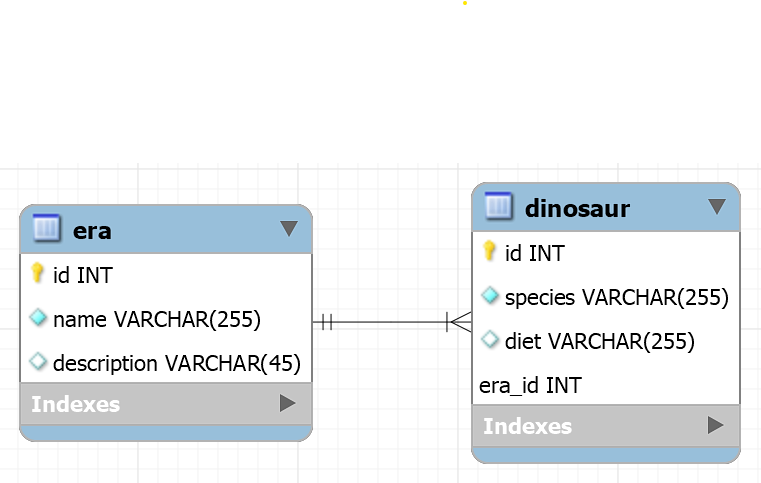

Vous avez les deux tables suivantes :

Créer les routes suivantes : 

Eras:
- GET /api/eras
- GET /api/eras/1
- POST /api/eras
- PUT /api/eras
- DELETE /api/eras

Dinosaurs:
- GET /api/dinosaurs
- GET /api/dinosaurs/1
- POST, PUT et DELETE optionnelles

Bonus:
- GET /api/eras/1/dinosaurs